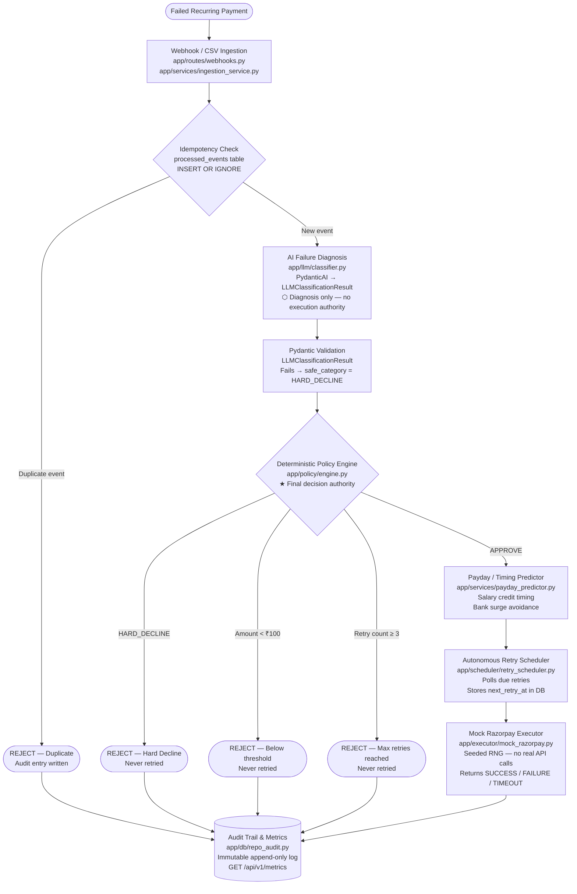

# Architecture

## System Overview

The Autonomous Indian PayDay & Mandate Retry Engine handles failed recurring payment and mandate transactions in India. When a payment fails, the system ingests the failure event (via webhook or batch CSV), checks for duplicate events, classifies the failure using a structured LLM, applies a deterministic Python policy engine to decide whether and when to retry, schedules eligible retries using a payday and bank-surge timing predictor, executes retries through a mock Razorpay layer (no real payments), and records every decision in an immutable audit trail.

The system is designed for the Razorpay AI Buildathon. All payment execution is simulated. All benchmark results are synthetic.

---

## Architecture Diagram

---

## Trust Boundary

The LLM is a **read-only classifier**. Its role is strictly limited to diagnosing the failure code and returning a structured `LLMClassificationResult`.

| What the LLM **may** do | What the LLM **must never** do |
|---|---|
| Classify a failure code into a `FailureCategory` | Execute or initiate payments |
| Return a confidence score (0.0–1.0) | Call any payment API (real or mock) |
| Return a human-readable rationale string | Modify transaction amounts |
| Produce output validated by a Pydantic model | Decide retry counts or limits |
| | Override or bypass policy rules |
| | Write to or modify database records |
| | Schedule retries directly |

**Enforcement mechanisms:**

1. **Pydantic validation** — All LLM output must pass `LLMClassificationResult` schema validation before the policy engine acts on it. Invalid output is treated as `HARD_DECLINE`.
2. **`safe_category` property** — The policy engine always reads `llm_result.safe_category`, which falls back to `HARD_DECLINE` if the LLM's confidence is below 0.5.
3. **Structural separation** — `app/llm/` has no imports from `app/db/`, `app/executor/`, or `app/scheduler/`. Verified by static inspection tests in the test suite.
4. **Mock-only executor** — `app/executor/mock_razorpay.py` uses a seeded RNG and contains no network I/O. It never connects to `api.razorpay.com`.
5. **Deterministic policy** — `app/policy/engine.py` applies all AGENTS.md safety rules after, and independently of, the LLM result. The LLM cannot raise the retry cap, lower the minimum amount, or unblock a hard decline.

---

## Retry Guardrails

These rules are enforced by `app/policy/guardrails.py` and `app/policy/engine.py`. They are deterministic, cannot be overridden by the LLM, and are independently unit-tested.

| Rule | Condition | Effect |
|---|---|---|
| **Maximum retries** | `retry_count >= 3` | Rejected — `MAX_RETRIES_BLOCK` |
| **Minimum amount** | `amount_paise < 10,000` (< ₹100) | Rejected — `MIN_AMOUNT_BLOCK` |
| **Hard decline** | `failure_category == HARD_DECLINE` | Rejected — `HARD_DECLINE_BLOCK` |
| **Duplicate webhook** | `event_id` already in `processed_events` | Rejected — `DUPLICATE_EVENT_BLOCK` (atomic `INSERT OR IGNORE`) |
| **Low-confidence LLM output** | `confidence < 0.5` | `safe_category` returns `HARD_DECLINE` |
| **Invalid LLM output** | Pydantic validation fails | Treated as `HARD_DECLINE` |

Guardrail evaluation order (first failure wins):

1. Duplicate event check
2. Hard-decline check
3. Minimum amount check
4. Maximum retry count check
5. All passed → **APPROVE**

---

## Main Components

### `app/routes/`
FastAPI route handlers. Each handler is thin: it validates the incoming payload with Pydantic and delegates immediately to a service function. Contains no business logic.

- `webhooks.py` — `POST /api/v1/webhook/payment-failed`
- `retries.py` — `GET /api/v1/retries/{transaction_id}`
- `audit.py` — `GET /api/v1/audit/{transaction_id}`
- `metrics.py` — `GET /api/v1/metrics`

### `app/services/`
Business logic and orchestration. Coordinates between the LLM layer, policy engine, and database repositories.

- `retry_service.py` — End-to-end orchestration: idempotency → classify → policy → schedule → audit
- `audit_service.py` — Reads and writes audit entries via the repository layer
- `metrics_service.py` — Computes aggregate metrics from live database state
- `ingestion_service.py` — Batch CSV ingestion; reuses the same pipeline as the webhook path
- `payday_predictor.py` — Deterministic timing predictor: salary credit windows, bank/NPCI surge avoidance (9–11 AM and 7–10 PM IST)

### `app/llm/`
LLM classifier. Bounded to read-only diagnosis.

- `classifier.py` — Async `classify_failure()`. Uses PydanticAI when a real LLM is configured; falls back to the mock classifier when the LLM is unavailable or `LLM_USE_MOCK=true`.
- `mock_classifier.py` — Deterministic fallback: maps known failure codes to categories via `FAILURE_CODE_MAP`. No network calls. Used in all tests and demos.

### `app/policy/`
Deterministic policy engine. Single source of truth for all retry decisions.

- `engine.py` — `evaluate()` — main entry point. Reads `llm_result.safe_category`, runs all guardrails, calculates retry schedule, returns `RetryPolicyDecision`.
- `guardrails.py` — Individual guardrail functions: `check_hard_decline`, `check_min_amount`, `check_max_retries`, `check_duplicate_event`, `run_all_guardrails`.
- `retry_rules.py` — `calculate_next_retry_at()` — delegates to the timing predictor to compute the scheduled retry datetime.
- `idempotency.py` — `is_duplicate_event()` — thin wrapper for testability.

### `app/scheduler/`
Background asyncio scheduler.

- `retry_scheduler.py` — `RetryScheduler` class. Polls `list_due_retries()` at a configurable interval, fires the mock executor for each due retry, updates transaction status, and writes an audit entry. Started from `app/main.py` lifespan when `SCHEDULER_ENABLED=true`.

### `app/executor/`
Mock payment executor.

- `mock_razorpay.py` — Simulates Razorpay payment outcomes using a seeded RNG (`MOCK_EXECUTOR_SEED`, `MOCK_EXECUTOR_SUCCESS_RATE`). Returns `SUCCESS`, `FAILURE`, or `TIMEOUT`. Contains no network I/O of any kind. Provides both an async `execute_payment()` and a synchronous `simulate_payment_sync()` for benchmark use.

### `app/db/`
SQLite database layer (WAL mode). All SQL is encapsulated here; no other module contains raw queries.

- `connection.py` — Singleton `aiosqlite` connection. Sets `PRAGMA journal_mode=WAL`, `PRAGMA foreign_keys=ON`.
- `schema.py` — DDL for four tables: `transactions`, `processed_events`, `retry_attempts`, `audit_log`.
- `repo_transactions.py` — CRUD for the `transactions` table; `list_due_retries()`.
- `repo_audit.py` — Append-only audit log; no UPDATE or DELETE operations.
- `repo_retries.py` — Idempotency guard (`try_claim_event` via `INSERT OR IGNORE`); retry attempt history.

### `benchmark/`
Reproducible A/B benchmark runner (synthetic simulation only).

- `dataset_generator.py` — Wraps `data/generate_data.py` to produce `list[FailureEvent]`.
- `baseline_runner.py` — Strategy A: fixed 24-hour retry window, no classification.
- `engine_runner.py` — Strategy B: full autonomous engine pipeline.
- `report.py` — CLI entry point. Runs both strategies, prints comparison, saves JSON to `benchmark/output/`.

### `dashboard/`
React single-page application (Vite, React 18, no chart library).

- Connects to the FastAPI backend at `VITE_API_BASE_URL` (default `http://127.0.0.1:8001`).
- Features: KPI cards, recovery comparison chart, retry pipeline diagram, demo scenarios, policy simulator, transaction journey timeline, recovery funnel, live audit log, business impact section.
- Contains **zero retry policy logic**. All decisions are made by the backend and displayed as received.

### `tests/`
Full test suite (pytest). 338 tests across unit and integration layers.

- `tests/unit/` — Policy rules, guardrails, models, classifier, timing predictor, dataset, benchmark, mock executor, database schema/repositories.
- `tests/integration/` — FastAPI `TestClient` tests for webhook ingestion, duplicate rejection, hard decline, below-threshold, retry status, and audit trail endpoints. Classifier regression tests.
- All tests run against an in-memory SQLite database and the deterministic mock LLM classifier. No real LLM API calls, no network I/O.

---

## Data Flow

**Lifecycle of a single failed payment:**

1. **Ingestion** — A `FailureEvent` payload arrives at `POST /api/v1/webhook/payment-failed` and is validated by Pydantic.
2. **Transaction creation** — `retry_service.handle_failure_event()` inserts a `transactions` row if the transaction is new.
3. **Idempotency claim** — `repo_retries.try_claim_event()` attempts an atomic `INSERT OR IGNORE` into `processed_events`. If the event was already processed, a duplicate-rejection `AuditEntry` is returned immediately.
4. **LLM classification** — `classify_failure()` calls the mock classifier (or a real PydanticAI agent if configured). The result is validated against `LLMClassificationResult`. If validation fails or confidence < 0.5, `safe_category` returns `HARD_DECLINE`.
5. **Policy evaluation** — `policy/engine.py:evaluate()` runs all guardrails in priority order. It produces a `RetryPolicyDecision` with `retry_allowed`, `scheduled_at`, `policy_rule`, and `reason`.
6. **Database update** — If approved, the transaction status is set to `RETRY_SCHEDULED` and a `retry_attempts` row is inserted. If rejected, the transaction is marked `PERMANENTLY_FAILED` (for hard declines and max-retry blocks) or `FAILED`.
7. **Audit write** — An `AuditEntry` is appended to the `audit_log` table. This is immutable; no UPDATE or DELETE is ever issued against `audit_log`.
8. **Scheduler execution** — The background `RetryScheduler` polls `list_due_retries()`. When a retry is due, it calls `mock_razorpay.execute_payment()`, updates the transaction status to `RECOVERED` or `FAILED`, and writes a second audit entry for the execution outcome.

---

## Technology Stack

| Layer | Technology |
|---|---|
| Language | Python 3.11+ |
| API framework | FastAPI 0.115 |
| Schema validation | Pydantic v2 / pydantic-settings |
| LLM integration | PydanticAI 0.0.14 (structured output) |
| Database | SQLite with WAL mode via aiosqlite |
| Async runtime | asyncio (built-in) |
| Background scheduler | asyncio tasks |
| Mock executor | Python `random.Random` (seeded) |
| Frontend framework | React 18 |
| Frontend build tool | Vite 6 |
| Frontend styling | Plain CSS (custom design system, no framework) |
| Test runner | pytest 8 with pytest-asyncio |
| Test coverage | pytest-cov |
| Dependency management | `pyproject.toml` with pinned versions |
| Package installer | pip / hatchling |

---

## Benchmark

The repository includes a reproducible synthetic benchmark in `benchmark/`. Running `python benchmark/report.py` processes exactly 1,000 deterministic failed payment records (seed 42) through two strategies and prints a comparison report.

| Strategy | Description |
|---|---|
| **A — Fixed 24h Baseline** | Retry all non-hard-decline failures once after 24 hours; no classification |
| **B — Autonomous Engine** | Mock LLM classification + deterministic policy + payday/surge timing + up to 3 retries |

**Synthetic simulation results (seed 42, not real-world data):**

| Metric | Baseline (A) | Engine (B) | Delta |
|---|---|---|---|
| Total transactions | 1,000 | 1,000 | — |
| Hard declines blocked | 376 | 376 | = |
| Below ₹100 blocked | 70 | 70 | = |
| Recovered | 400 | 530 | **+130** |
| Recovery rate | 40.0 % | 53.0 % | **+13 pp** |
| Avg retries per approved | 1.0 | 1.38 | — |

> ⚠️ **SYNTHETIC SIMULATION — NOT REAL-WORLD DATA.**
> All records are generated from `data/generate_data.py` using a fixed random seed.
> Results do not represent real payment recovery rates or production performance.
> The executor simulates outcomes using a seeded RNG with no connection to real banking infrastructure.
